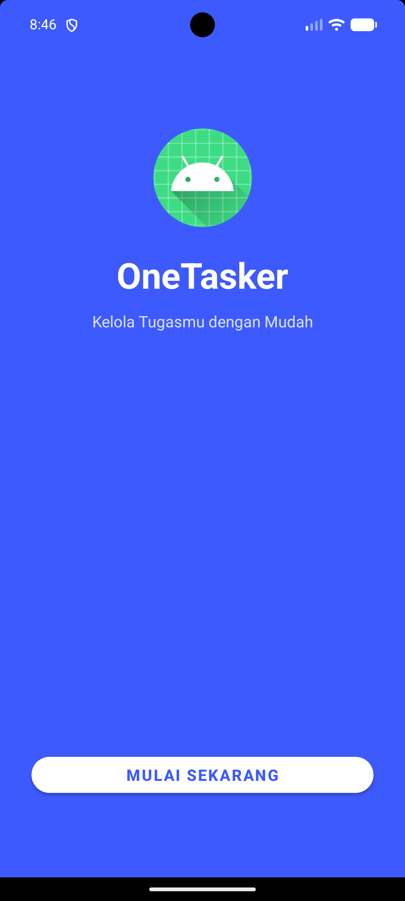
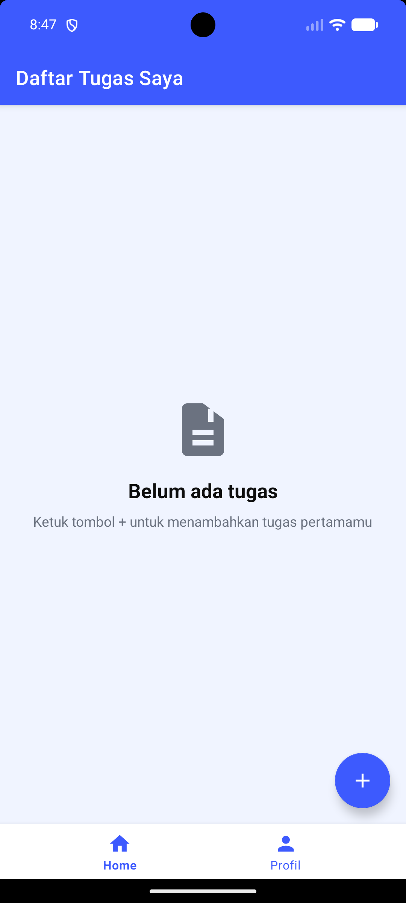
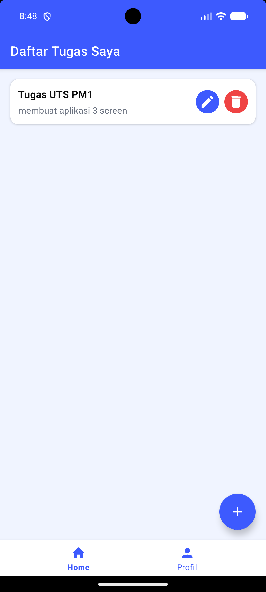
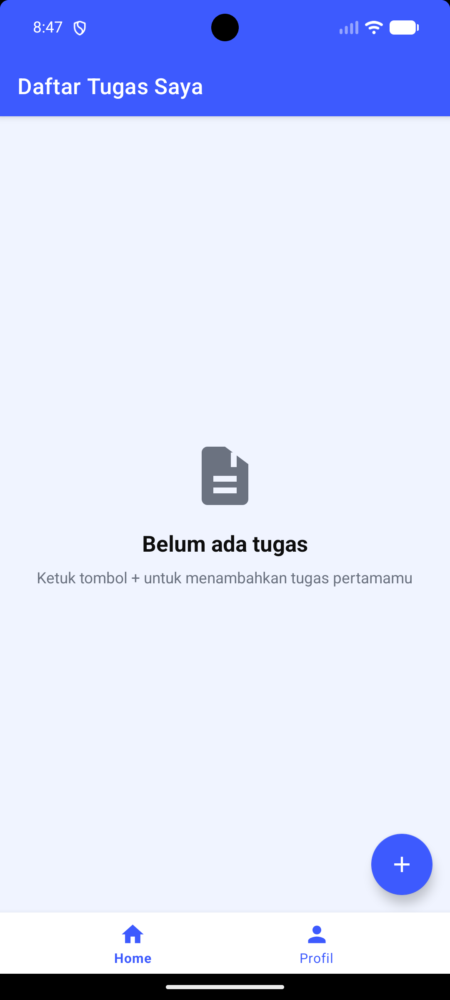
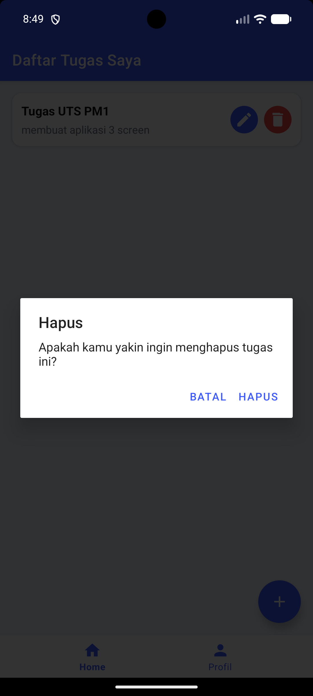
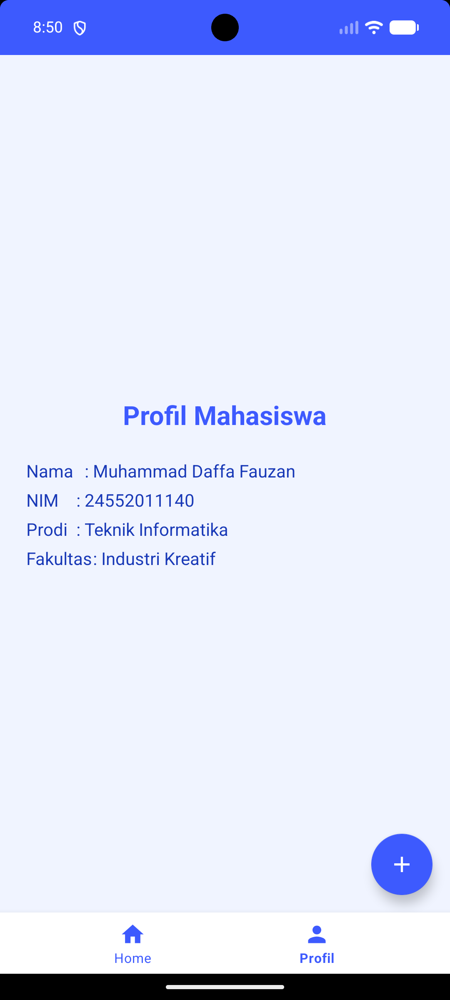

# OneTasker — Aplikasi Manajemen Tugas Android

> **Tugas UTS — Pemrograman Mobile 1**
> Dibangun menggunakan **Kotlin + XML** dengan arsitektur sederhana berbasis Activity.

---

## Daftar Isi

- [Deskripsi Aplikasi](#deskripsi-aplikasi)
- [Fitur Utama](#fitur-utama)
- [Teknologi yang Digunakan](#teknologi-yang-digunakan)
- [Struktur Proyek](#struktur-proyek)
- [Alur Aplikasi](#alur-aplikasi)
- [Tangkapan Layar](#tangkapan-layar)
- [Persyaratan Sistem](#persyaratan-sistem)
- [Cara Menjalankan Proyek](#cara-menjalankan-proyek)
- [Informasi Mahasiswa](#informasi-mahasiswa)
- [Sumber Dokumentasi](#sumber-dokumentasi)

---

## Deskripsi Aplikasi

**OneTasker** adalah aplikasi *to-do list* berbasis Android yang dirancang untuk membantu pengguna mengelola tugas harian dengan mudah dan efisien. Aplikasi ini merupakan versi *mobile* yang diadaptasi dari OneTasker versi web, dengan tampilan antarmuka yang modern, ringan, dan responsif.

Aplikasi ini dibangun sebagai bagian dari tugas Ujian Tengah Semester (UTS) mata kuliah Pemrograman Mobile 1, dengan menerapkan konsep dasar pengembangan aplikasi Android menggunakan bahasa pemrograman Kotlin.

---

## Fitur Utama

| Fitur | Deskripsi |
|---|---|
| **Splash Screen** | Halaman pembuka dengan tampilan *hero* berwarna biru bermerek "OneTasker" |
| **Daftar Tugas** | Menampilkan seluruh tugas dalam bentuk kartu (*card*) yang bersih dan terstruktur |
| **Tambah Tugas** | Formulir untuk menambahkan tugas baru dengan nama dan deskripsi |
| **Edit Tugas** | Mengubah isi tugas yang telah tersimpan langsung dari tombol di kartu tugas |
| **Hapus Tugas** | Menghapus tugas dengan konfirmasi dialog agar tidak terjadi penghapusan tidak disengaja |
| **Empty State** | Tampilan khusus ketika belum ada tugas, disertai panduan bagi pengguna |
| **Bottom Navigation** | Navigasi bawah untuk berpindah antara tab Beranda dan tab Profil |
| **Profil Mahasiswa** | Halaman yang menampilkan identitas mahasiswa pembuat aplikasi |

---

## Teknologi yang Digunakan

| Komponen | Detail |
|---|---|
| **Bahasa Pemrograman** | Kotlin 1.9.23 |
| **Platform** | Android (minSdk 24 / Android 7.0 Nougat ke atas) |
| **Target SDK** | API 34 (Android 14) |
| **Android Gradle Plugin** | 8.3.2 |
| **UI Library** | Material Components for Android 1.11.0 |
| **Layout** | XML dengan ConstraintLayout 2.1.4 dan LinearLayout |
| **View Binding** | ViewBinding (diaktifkan) |
| **Navigasi** | Intent antar-Activity (tanpa Navigation Component) |
| **Penyimpanan Data** | In-memory via `companion object ArrayList<String>` |
| **Tema Dasar** | `Theme.MaterialComponents.Light.NoActionBar` |
| **Pengujian** | JUnit 4.13.2, Espresso 3.5.1 |

> **Catatan:** Aplikasi ini tidak menggunakan arsitektur MVVM, Room Database, Retrofit, Jetpack Compose, maupun Dependency Injection. Semua dirancang sederhana sesuai standar pembelajaran.

---

## Struktur Proyek

```
OneTasker/
├── app/
│   ├── src/
│   │   └── main/
│   │       ├── java/com/example/onetasker/
│   │       │   ├── SplashActivity.kt        # Halaman pembuka
│   │       │   ├── DashboardActivity.kt     # Halaman utama & daftar tugas
│   │       │   └── AddTaskActivity.kt       # Halaman tambah & edit tugas
│   │       ├── res/
│   │       │   ├── drawable/
│   │       │   │   ├── ic_add.xml           # Ikon tambah (FAB)
│   │       │   │   ├── ic_edit.xml          # Ikon edit (pensil)
│   │       │   │   ├── ic_delete.xml        # Ikon hapus (tempat sampah)
│   │       │   │   ├── ic_back.xml          # Ikon kembali (panah)
│   │       │   │   ├── ic_task_empty.xml    # Ilustrasi empty state
│   │       │   │   ├── ic_nav_home.xml      # Ikon navigasi beranda
│   │       │   │   ├── ic_nav_profile.xml   # Ikon navigasi profil
│   │       │   │   ├── btn_edit_bg.xml      # Latar tombol edit (oval biru)
│   │       │   │   └── btn_delete_bg.xml    # Latar tombol hapus (oval merah)
│   │       │   ├── layout/
│   │       │   │   ├── activity_splash.xml      # Layout halaman pembuka
│   │       │   │   ├── activity_dashboard.xml   # Layout halaman utama
│   │       │   │   ├── activity_add_task.xml    # Layout tambah/edit tugas
│   │       │   │   └── item_task.xml            # Layout kartu per tugas
│   │       │   ├── menu/
│   │       │   │   └── bottom_nav_menu.xml  # Menu bottom navigation
│   │       │   └── values/
│   │       │       ├── colors.xml           # Palet warna aplikasi
│   │       │       ├── strings.xml          # Teks & label aplikasi
│   │       │       └── themes.xml           # Definisi tema Material
│   │       └── AndroidManifest.xml          # Konfigurasi aplikasi & Activity
│   └── build.gradle                         # Konfigurasi build modul app
├── screenshots/                             # Tangkapan layar aplikasi
├── build.gradle                             # Konfigurasi build root
├── settings.gradle.kts                      # Konfigurasi modul proyek
└── README.md                                # Dokumentasi ini
```

---

## Alur Aplikasi

Berikut adalah alur navigasi lengkap antarhalamanpada aplikasi OneTasker:

```
[ Buka Aplikasi ]
        |
        v
┌─────────────────────┐
│   Splash Screen     │  ← Halaman pembuka, latar biru bermerek "OneTasker"
│  (SplashActivity)   │
│                     │
│  [Mulai Sekarang]   │
└────────┬────────────┘
         │ Tap tombol → finish() (tidak bisa kembali ke Splash)
         v
┌────────────────────────────────────────────┐
│             Dashboard                      │
│          (DashboardActivity)               │
│                                            │
│  ┌──────────────────────────────────────┐  │
│  │ Tab: Beranda (default)               │  │
│  │                                      │  │
│  │  [Jika belum ada tugas]              │  │
│  │   → Tampil empty state + panduan     │  │
│  │                                      │  │
│  │  [Jika ada tugas]                    │  │
│  │   → Kartu tugas: Judul + Deskripsi  │  │
│  │     [✏️ Edit]  [🗑️ Hapus]            │  │
│  │                                      │  │
│  │  [FAB +] ──→ Halaman Tambah Tugas   │  │
│  └──────────────────────────────────────┘  │
│                                            │
│  ┌──────────────────────────────────────┐  │
│  │ Tab: Profil                          │  │
│  │   → Nama, NIM, Prodi, Fakultas      │  │
│  └──────────────────────────────────────┘  │
└───────────┬────────────────────────────────┘
            │ (dari kartu: tap Edit, atau tap FAB)
            v
┌─────────────────────────────┐
│      Tambah / Edit Tugas    │
│       (AddTaskActivity)     │
│                             │
│  [← Kembali]  Toolbar       │
│                             │
│  Input: Nama Tugas*         │
│  Input: Deskripsi (opsional)│
│                             │
│  [Simpan Tugas]             │
│     → Validasi nama wajib   │
│     → Simpan ke taskList    │
│     → Toast konfirmasi      │
│     → finish() → Dashboard  │
└─────────────────────────────┘
```

### Penjelasan Penyimpanan Data

Seluruh data tugas disimpan secara **in-memory** menggunakan `companion object` pada `DashboardActivity`:

```kotlin
companion object {
    val taskList = ArrayList<String>()
}
```

Setiap tugas direpresentasikan sebagai `String` dengan format:
- **Jika ada deskripsi:** `"Nama Tugas - Deskripsi"`
- **Jika tanpa deskripsi:** `"Nama Tugas"`

> **Penting:** Data tugas **tidak tersimpan permanen**. Menutup aplikasi sepenuhnya akan menghapus seluruh tugas. Hal ini disengaja sesuai ketentuan tugas (tanpa database).

---

## Tangkapan Layar

Berikut adalah tangkapan layar aplikasi OneTasker pada berbagai halaman:

### 01. Splash Screen (Halaman Pembuka)
Halaman pertama yang muncul saat membuka aplikasi dengan tema biru bermerek, logo OneTasker, slogan, dan tombol "Mulai Sekarang".



---

### 02. Dashboard - Empty State
Ditampilkan saat belum ada tugas. Menampilkan ikon kosong dan panduan menambah tugas pertama.



---

### 03. Dashboard - Daftar Tugas
Menampilkan daftar tugas dalam bentuk kartu (MaterialCardView) dengan tombol edit dan hapus inline, dilengkapi FloatingActionButton untuk menambah tugas.



---

### 04. Form Tambah Tugas
Halaman untuk membuat tugas baru dengan Toolbar Material, TextInputLayout untuk nama dan deskripsi, serta tombol "Simpan Tugas".



---

### 05. Form Edit Tugas
Form serupa dengan halaman tambah, tetapi field sudah terisi dengan data tugas lama dan tombol berubah menjadi "Edit Tugas".


---

### 06. Dialog Konfirmasi Hapus
AlertDialog yang muncul saat pengguna menekan tombol delete dengan pesan konfirmasi dan opsi Hapus/Batal.



---

### 07. Tab Profil Mahasiswa
Halaman profil yang menampilkan informasi pembuat aplikasi (Nama, NIM, Prodi, Fakultas).



---

## Persyaratan Sistem

Untuk menjalankan proyek ini, diperlukan:

| Persyaratan | Versi Minimum |
|---|---|
| Android Studio | Hedgehog (2023.1.1) atau lebih baru |
| JDK | 17 atau lebih baru |
| Android SDK | API 34 (Android 14) |
| Gradle | 9.3.1 |
| Android Emulator / Perangkat Fisik | Android 7.0 (API 24) ke atas |
| RAM Komputer | Minimal 8 GB (disarankan 16 GB) |

---

## Cara Menjalankan Proyek

Ikuti langkah-langkah berikut untuk menjalankan aplikasi OneTasker di lingkungan pengembangan lokal:

### 1. Kloning Repositori

```bash
git clone <url-repositori>
cd OneTasker
```

### 2. Buka dengan Android Studio

1. Buka **Android Studio**.
2. Pilih menu **File → Open**.
3. Arahkan ke folder `OneTasker` hasil kloning.
4. Tunggu proses sinkronisasi Gradle selesai.

### 3. Konfigurasi Emulator

1. Buka **Device Manager** di Android Studio (ikon kanan atas atau menu **Tools → Device Manager**).
2. Klik **Create Virtual Device**.
3. Pilih perangkat (misalnya: **Pixel 6**) lalu klik **Next**.
4. Pilih System Image **API 34** (Android 14), klik **Download** jika belum tersedia, lalu **Next**.
5. Klik **Finish** untuk menyimpan konfigurasi emulator.

### 4. Jalankan Aplikasi

1. Pastikan emulator sudah berjalan atau perangkat fisik sudah terhubung.
2. Klik tombol **Run ▶** (atau tekan `Shift + F10`).
3. Pilih emulator/perangkat yang akan digunakan.
4. Tunggu proses build dan instalasi selesai.

### 5. Build Manual via Terminal (Opsional)

```bash
# Build debug APK
./gradlew assembleDebug

# Lokasi APK hasil build:
# app/build/outputs/apk/debug/app-debug.apk
```

---

## Informasi Mahasiswa

| Keterangan        | Detail                        |
|-------------------|-------------------------------|
| **Nama**          | Muhammad Daffa Fauzan         |
| **NIM**           | 24552011140                   |
| **Program Studi** | Teknik Informatika            |
| **Fakultas**      | Industri Kreatif              |
| **Kampus**        | Universitas Teknologi Bandung |
| **Mata Kuliah**   | Pemrograman Mobile 1          |
| **Jenis Tugas**   | Ujian Tengah Semester (UTS)   |

---

## Sumber Dokumentasi

Dokumentasi pendukung, termasuk **video demonstrasi** aplikasi dan berkas presentasi, tersedia melalui tautan Google Drive berikut:

> 📁 **[Akses Dokumentasi Lengkap di Google Drive](https://drive.google.com/drive/folders/GANTI_DENGAN_LINK_GDRIVE_ANDA)**

Isi dokumentasi yang tersedia:

| Dokumen | Keterangan |
|---|---|
| 🎬 Video Demo Aplikasi | Rekaman layar demonstrasi fitur-fitur OneTasker |
| 📊 Slide Presentasi | Materi presentasi UTS dalam format PDF/PPTX |
| 📸 Tangkapan Layar | Koleksi screenshot seluruh halaman aplikasi |
| 📄 Laporan Tugas | Dokumen laporan tertulis UTS (jika ada) |

---

<p align="center">
  Dibuat dengan ❤️ oleh <strong>Muhammad Daffa Fauzan</strong> — UTS Pemrograman Mobile 1
</p>
